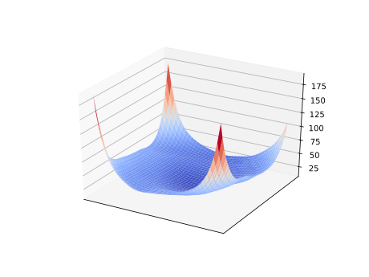
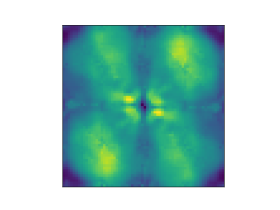

# anatome 

Ἀνατομή is a PyTorch library to analyze internal representation of neural networks

This project is under active development and the codebase is subject to change.

## Installation

`anatome` requires

```
Python>=3.9.0
PyTorch>=1.9.0
torchvision>=0.10.0
```

After the installation of PyTorch, install `anatome` as follows:

```
pip install -U git+https://github.com/moskomule/anatome
```

## Available Tools

### Representation Similarity

To measure the similarity of learned representation, `anatome.SimilarityHook` is a useful tool. Currently, the following
methods are implemented.

- [Raghu et al. NIPS2017 SVCCA](https://papers.nips.cc/paper/7188-svcca-singular-vector-canonical-correlation-analysis-for-deep-learning-dynamics-and-interpretability)
- [Marcos et al. NeurIPS2018 PWCCA](https://papers.nips.cc/paper/7815-insights-on-representational-similarity-in-neural-networks-with-canonical-correlation)
- [Kornblith et al. ICML2019 Linear CKA](http://proceedings.mlr.press/v97/kornblith19a.html)
- [Ding et al. arXiv Orthogonal Procrustes distance](https://arxiv.org/abs/2108.01661)

```python
import torch
from torchvision.models import resnet18
from anatome import DistanceHook

model = resnet18()
hook1 = DistanceHook(model, "layer3.0.conv1")
hook2 = DistanceHook(model, "layer3.0.conv2")
model.eval()
with torch.no_grad():
    model(torch.randn(128, 3, 224, 224))
# downsampling to (size, size) may be helpful
hook1.distance(hook2, size=8)
hook1.clear()
hook2.clear()
```

### Loss Landscape Visualization

- [Li et al. NeurIPS2018](https://papers.nips.cc/paper/7875-visualizing-the-loss-landscape-of-neural-nets)

```python
from anatome import landscape2d

x, y, z = landscape2d(resnet18(),
                      data,
                      F.cross_entropy,
                      x_range=(-1, 1),
                      y_range=(-1, 1),
                      step_size=0.1)
imshow(z)
```




### Fourier Analysis

- Yin et al. NeurIPS 2019 etc.,

```python
from anatome import fourier_map

map = fourier_map(resnet18(),
                  data,
                  F.cross_entropy,
                  norm=4)
imshow(map)
```



## Citation

If you use this implementation in your research, please cite as:

```
@software{hataya2020anatome,
    author={Ryuichiro Hataya},
    title={anatome, a PyTorch library to analyze internal representation of neural networks},
    url={https://github.com/moskomule/anatome},
    year={2020}
}
```
